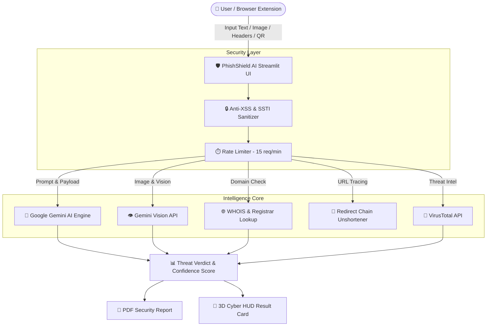

# 🛡️ PhishShield AI — Next-Gen Threat Defense Platform

[](https://share.streamlit.io/)


> **PhishShield AI** is an advanced, AI-powered cybersecurity intelligence platform built with **Streamlit** and **Google Gemini AI (`google-genai`)**. It detects phishing, smishing, quishing, social engineering, credential harvesting, and suspicious domain patterns across messages, headers, QR codes, screenshots, and batch URLs.

---

## 🌟 Key Features

- 📝 **Text & Link Analyzer**: Detects phishing in email bodies, SMS, social media messages, and URLs with built-in prompt injection defense.
- 🖼️ **Vision & Screenshot Scanner**: Multimodal analysis of fake login pages, email captures, and suspicious screenshots using Gemini Multimodal Vision.
- 📧 **Email Header Forensics**: Parses and evaluates SPF, DKIM, DMARC, Return-Path, and routing hops for spoofing and forgery.
- 📷 **QR Code ("Quishing") Scanner**: Uses OpenCV to decode embedded QR code payload URLs and inspect target safety.
- 📋 **Batch URL Inspector**: Scans up to 20 URLs simultaneously with risk breakdown metrics and threat summaries.
- 🔗 **URL Unshortener & WHOIS**: Traces redirect chains (`bit.ly`, `tinyurl`) and domain creation age to flag newly registered burner domains.
- 📄 **PDF Audit Export**: Generates sanitized audit reports.
- 🌐 **13 Languages**: Provides threat briefing explanations in English, Hindi, Spanish, French, German, Arabic, Japanese, Korean, Chinese, Russian, Bengali, Urdu, and Portuguese.
- 🌙 / ✨ **Dual 3D Themes**: Features **Cosmic Purple** (Dark Cyberpunk) & **Crystal Violet** (Light Daylight Cyber) themes.

---

## 📐 System Architecture



---

## 🚀 Quick Start (Local Setup)

### 1. Clone & Install Dependencies
```bash
git clone https://github.com/your-username/phishshield-ai.git
cd phishshield-ai

python -m venv venv
# Windows:
venv\Scripts\activate
# Linux/macOS:
source venv/bin/activate

pip install -r requirements.txt
```

### 2. Configure Environment
Create a `.env` file in the root directory:
```ini
GEMINI_API_KEY=your_gemini_api_key_here
VIRUSTOTAL_API_KEY=your_virustotal_api_key_here_optional
```

### 3. Launch App
```bash
streamlit run app.py
```
Open your browser at `http://localhost:8501`.

---

## 🌐 Cloud Deployment Guide

### Option 1: Streamlit Community Cloud (Free - Recommended)
1. Push your repository to GitHub.
2. Go to [share.streamlit.io](https://share.streamlit.io) and click **"New App"**.
3. Select your repository `phishshield-ai` and set main file path to `app.py`.
4. Under **"Advanced Settings" -> "Secrets"**, add your API key:
   ```toml
   GEMINI_API_KEY = "your_gemini_api_key_here"
   ```
5. Click **Deploy**!

---

## 🧩 Chrome Extension Setup

1. Open Chrome and navigate to `chrome://extensions/`.
2. Toggle **Developer mode** on (top-right).
3. Click **Load unpacked** and select the `chrome-extension/` directory.
4. Click the **PhishShield AI** icon in your browser toolbar to scan active tabs in 1-click!

---

## 🛡️ Security Architecture

PhishShield AI incorporates enterprise-grade safety controls:
- **Strict Input Sanitization**: Prevents Cross-Site Scripting (XSS), Server-Side Template Injection (SSTI), and XML External Entity (XXE) vectors.
- **Safe PDF Rendering**: Sanitizes Unicode strings to avoid FPDF buffer exceptions.
- **Zero Raw Code Exposure**: Eliminates Markdown code block leakage in user-facing HUD outputs.

---

## 📜 License & Disclaimers

Distributed under the **MIT License**. See `LICENSE` for more information.

*Disclaimer: PhishShield AI is an AI-assisted threat detection tool designed for educational and defensive analysis. Always exercise caution when handling unverified links or attachments.*
